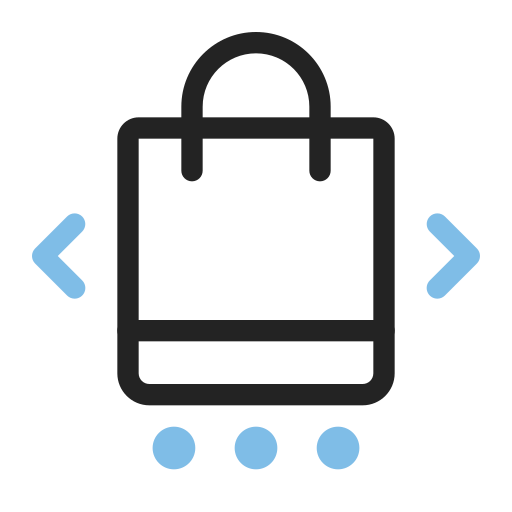

<p align="center">
<!-- <a href="https://github.com/SouravBarmanBS23/flutter_ecommerce_module/actions"></a>
   -->
<a href="https://github.com/SouravBarmanBS23/flutter_ecommerce_module"></a>
<a href="https://github.com/SouravBarmanBS23/flutter_ecommerce_module/releases"></a>
<a href="http://www.apache.org/licenses/"></a>
</p>

# Welcome to ShopSphere – Your Ultimate Shopping Destination!

<table>
  <tr>
    <td>
       
      <p>
        Step into a world of endless possibilities where shopping becomes an experience, not just a task. 
        At ShopSphere, we bring you a carefully curated selection of the latest trends, 
        fashion essentials, and must-have gadgets. 
        Our user-friendly app ensures a seamless journey from discovery to checkout, 
        making your shopping experience delightful and stress-free.
      </p>
    </td>
  </tr>
</table>
<table>
  <tr>
     <td>Login</td>
     <td>Registration</td>
     <td>Reset Password</td>
     <td>Update Password</td>
     <td>Home Page</td>
  </tr>
  <tr>
    <td></td>
    <td></td>
    <td></td>
    <td></td>
    <td></td>
  </tr>
    <tr>
     <td>Category Product Search</td>
     <td>Featured Product Search</td>
     <td>Product Details</td>
     <td>Product Review</td>
     <td>Shop Details</td>
    </tr>
    <tr>
    <td></td>
    <td></td>
    <td></td>
    <td></td>
    <td></td>
    </tr>

 </table>
<br> Please star⭐ the repo if you like what you see.

## Project Environment:
```
Flutter 3.13.3 • channel stable • https://github.com/flutter/flutter.git
Framework • revision 2524052335 (3 months ago) • 2023-09-06 14:32:31 -0700
Engine • revision b8d35810e9
Tools • Dart 3.1.1 • DevTools 2.25.0
```
## Project Structure
In this project, I have implemented the Clean Architecture design pattern. 
For state management, I utilized flutter_riverpod version 2.3.6. 
Furthermore, I integrated the Fake Store API to fetch various types of products.
Additionally, I implemented remote and local product search functionality for both the category and featured product sections.

```
└── lib/
    └── features/
        ├── account              
        ├── authentication
        ├── home
        ├── order
        └── wish_list
```


## Feature List
```
├── Login & Registration
├── Product Search
├── Product Details
├── Product Review
└── Shop Details 
└── Remote & Local Product Search
  
    
```
```P.S - To see on going work, feature list please check issues section and projects section```


To learn more about riverpod:<br>
https://codewithandrea.com/videos/flutter-state-management-riverpod/<br>
To learn more about Clean architecture:<br>
[https://medium.flutterdevs.com/design-patterns-in-flutter-part-1-c32a3ddb00e2](https://medium.com/ruangguru/an-introduction-to-flutter-clean-architecture-ae00154001b0)https://medium.com/ruangguru/an-introduction-to-flutter-clean-architecture-ae00154001b0<br>
To Install flutter:<br>
https://flutter.dev/docs/get-started/install
